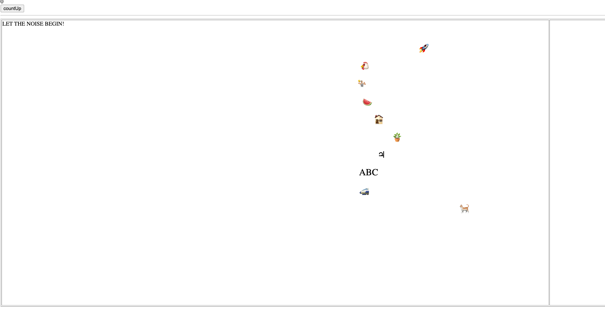

# OVER ALL GOAL:
Figure out how to make cypress use 'computer vision' - likely image comparisons like sikuli?

# TOY GOAL: 
Detect when one of the below icons 'wins' the race

# HOW TO RUN ThE html:
node server.js -> localhost:3030/

# HOW TO RUN THE cypress:
npx cypress open 

# THE RACE: 

